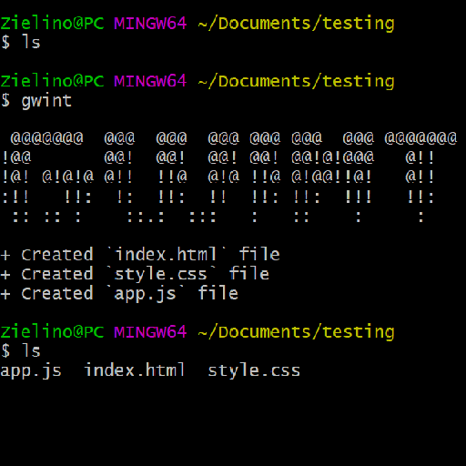
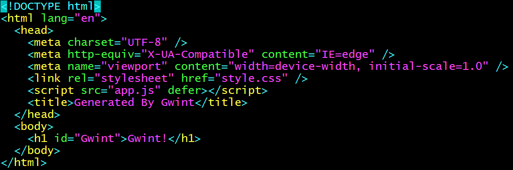

# Gwint

A CLI to generate simple website template

## Instalation

Download or fork the repo

```
git clone https://github.com/Zielin0/Gwint-CLI.git
```

Then in folder named Gwint-CLI

```
npm install
```

And

```
npm install -g
```

## Usage

Use command `gwint` in your CMD

## Showcase






## License

[MIT](https://choosealicense.com/licenses/mit/)
